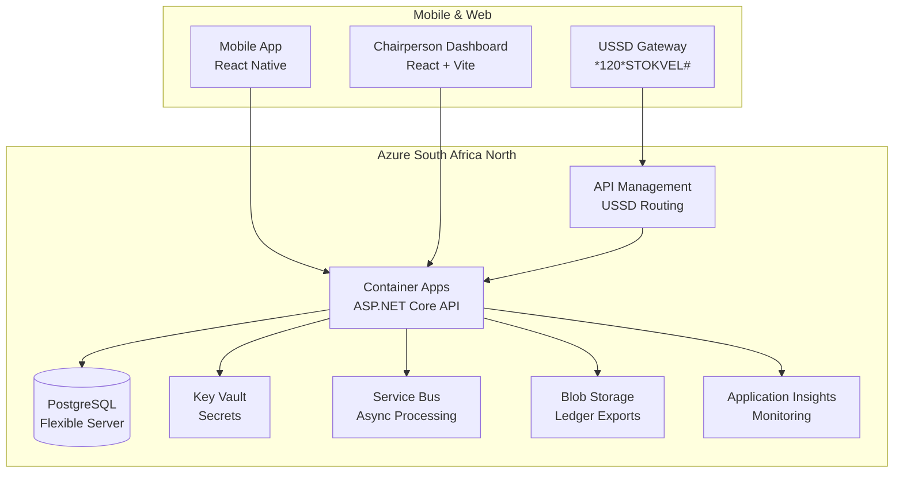

# Architecture Documentation

This directory contains architecture diagrams, design documents, and technical specifications for the Digital Stokvel Banking platform.

## Contents

### High-Level Architecture
- System context diagram
- Container diagram (C4 model)
- Component diagrams
- Data flow diagrams

### Integration Patterns
- USSD gateway integration
- MNO API integration patterns
- Payment processing flows
- Notification delivery architecture

### Security Architecture
- Authentication and authorization flows
- Data encryption at rest and in transit
- POPIA compliance architecture
- FICA regulatory compliance

### Database Schema
- Entity-relationship diagrams
- Table definitions
- Index strategies
- Migration patterns

## Placeholder for Diagrams

## License

Proprietary - All rights reserved.
