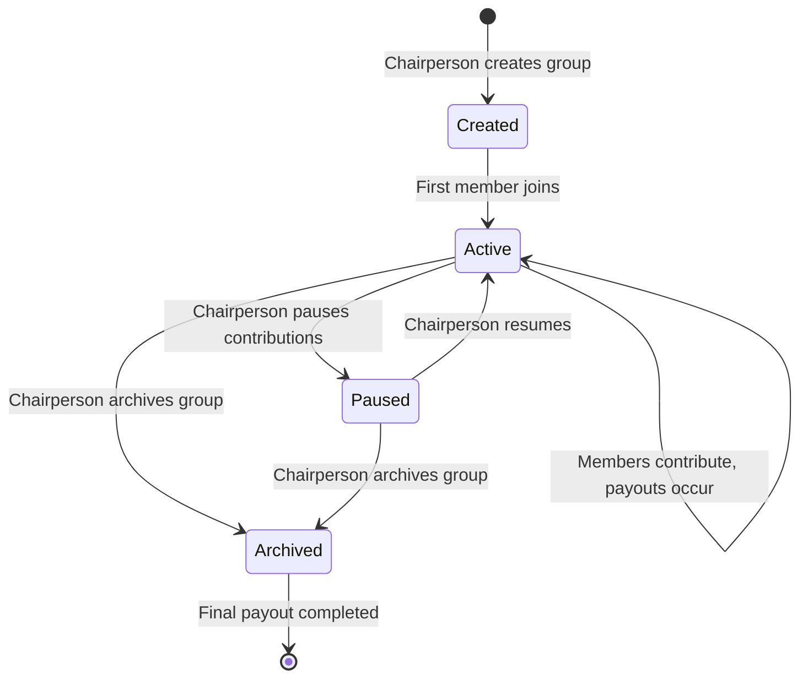
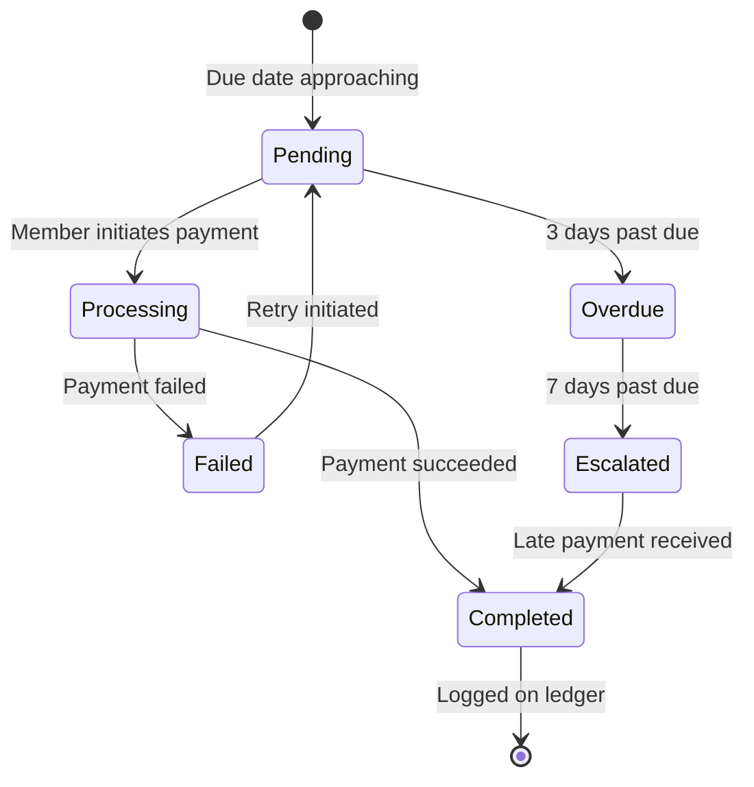

# Digital Stokvel Banking

## 1. Overview

**Product Name:** Digital Stokvel Banking  
**Summary:** A bank-native feature set that brings South Africa's deeply rooted cultural savings practice (stokvels) into the formal financial ecosystem. By digitalizing group savings with interest-bearing accounts, fraud protection, and credit profile building, the bank gains access to an estimated R50 billion annually flowing through 11 million participants while offering genuine value to underserved communities.  
**Target Platform:** Android, iOS, USSD (feature phones), Web Browser  
**Key Constraints:**  
- Must support USSD for financial inclusion (feature phone users)
- POPIA and FICA compliance mandatory
- Cultural sensitivity paramount — bank is infrastructure, not leader
- MVP launch target: 3 months
- Must operate in low-connectivity environments (offline-tolerant)

---

## 2. Version History

| Version | Date | Author | Changes |
|---------|------|--------|---------|
| 1.0 | 2026-03-24 | Product Team | Initial PRD based on research document |

---

## 3. Goals and Non-Goals

### 3.1 Goals
- Formalize R50B+ annual stokvel savings within the formal banking system
- Enable 11M+ stokvel participants to earn interest on pooled deposits
- Generate sustainable interest revenue from pooled deposits (2-3% net margin)
- Deepen customer relationships by making the bank the home of community savings
- Create verifiable savings track record for credit inclusion (Phase 2)
- Achieve 500 active groups and 5,000 members within 3 months (MVP)
- Scale to 10,000 groups and 100,000 members within 12 months
- Ensure financial inclusion via USSD support for feature phone users (30% of groups)

### 3.2 Non-Goals
- Not replacing traditional stokvels — augmenting them with digital infrastructure
- Not targeting funeral societies or burial insurance in MVP (Phase 2 feature)
- Not building a standalone app — this is a bank-native feature set
- Not competing with informal cash-only stokvels — targeting groups ready to digitize
- Not offering investment products in MVP (Phase 2: stokvel-to-investment bridge)
- Not providing peer-to-peer lending (focus is group savings, not credit origination in MVP)

---

## 4. User Stories / Personas

### 4.1 Personas

| Persona | Description | Key Needs |
|---------|-------------|-----------|
| The Chairperson (Umseki) | Typically female, 30–55 years old. Manages group roster, tracks contributions, handles disputes. Tech-comfortable but values simplicity. Often a trusted community figure. | Visibility, control, and tools to manage the group fairly without WhatsApp chaos. Digital ledger transparency. Reduction of administrative burden. |
| The Member (Ilungu) | Working adult, mixed digital literacy (smartphone or feature phone). Contributing monthly toward year-end payout or rotating pot. Values community savings tradition. | Transparency on group funds, easy contribution via phone, proof of payments, trust that funds are secure, ability to build credit history. |
| The Feature Phone User | Lower-income, no smartphone. Relies on USSD for banking. Often domestic worker, informal trader, or rural resident. Limited data access. | Ability to participate in digitized group without needing smartphone or data. SMS confirmations. Simple USSD menus with clear instructions. |
| The Financially Excluded | Unbanked or thin-file customer. Uses stokvels as primary savings vehicle. No formal credit history despite consistent savings behavior. | A way to save formally, earn interest, build financial identity, access to credit products based on stokvel participation history. |

### 4.2 User Stories

| ID | As a... | I want to... | So that... | Priority |
|----|---------|-------------|-----------|----------|
| US-01 | Chairperson | Create a named stokvel group with contribution rules | I can invite members and start collecting digital contributions | Must |
| US-02 | Chairperson | Invite members via phone number, link, or QR code | Members can join easily without technical barriers | Must |
| US-03 | Chairperson | View real-time group balance and full contribution history | I have transparency and can answer member questions | Must |
| US-04 | Chairperson | Initiate payouts with Treasurer confirmation | Funds are disbursed fairly according to group rules | Must |
| US-05 | Chairperson | Set up automated reminders for missed contributions | Members are notified without me having to chase them manually | Must |
| US-06 | Member | Contribute via one-tap payment from my bank account | I can pay quickly and have proof of payment | Must |
| US-07 | Member | Set up recurring debit order for contributions | I never miss a payment and maintain my contribution streak | Must |
| US-08 | Member | View my contribution history and receipts | I have proof of all payments for my records | Must |
| US-09 | Member | Receive payout notifications and confirmations | I know when funds are disbursed and where they went | Must |
| US-10 | Feature Phone User | Contribute via USSD (*120*STOKVEL#) | I can participate without a smartphone or data | Must |
| US-11 | Feature Phone User | Check my contribution status via USSD | I can verify my payments using any mobile network | Must |
| US-12 | Feature Phone User | Receive SMS payment confirmations | I have proof of payment even without app access | Must |
| US-13 | Member | Opt in to credit profile building | My consistent contributions are reported to credit bureaus | Should |
| US-14 | Member | View my "Stokvel Score" | I understand how my savings behavior affects creditworthiness | Should |
| US-15 | Chairperson | Export group ledger as PDF | I can present financial records at annual AGM | Should |
| US-16 | Chairperson | Define group constitution with rules for missed payments | Group governance is formalized and disputes are minimized | Must |
| US-17 | Member | Raise a dispute flag | Conflicts are escalated to bank mediation if unresolved | Must |
| US-18 | Chairperson | Conduct in-app voting for major decisions | Democratic group governance is maintained digitally | Must |
| US-19 | Member | Use the app in my home language | I feel comfortable and trust the platform | Must |
| US-20 | Member | Receive financial wellness nudges post-payout | I learn how to grow my savings and understand interest earned | Should |

---

## 5. Research Findings

### 5.1 Market Opportunity

**Stokvel Market in South Africa:**
- 11.4 million participants (National Stokvel Association of SA, 2023)
- R49–54 billion in annual contributions
- 820,000 active stokvels nationwide
- Average group: 12–15 members
- Average contribution: R500–R2,000 per month per member
- 68% of participants are women
- 0% currently earn interest on pooled funds
- 0% build credit history through stokvel participation

**Financial Inclusion Gap:**
- 33% of South African adults are financially excluded or underbanked (World Bank)
- 19% of South Africans still use feature phones (StatsSA)
- USSD is the primary digital banking channel for low-income users

**Competitive Landscape:**
- Major banks (Standard Bank, FNB, Absa, Nedbank, Capitec) have no formal stokvel products
- Fintech players (TymeBank, Stokvela) attempting to enter space but lack trust and scale
- Bank advantage: existing customer relationships, FSCA regulation, deposit insurance, interest-bearing infrastructure

### 5.2 Technology Currency Verification

| Technology | Version Specified | Latest Stable | Status | Notes |
|------------|------------------|---------------|--------|-------|
| .NET | 10 (future) | .NET 9 (Nov 2024) | ✅ Future-proof | .NET 10 planned for Nov 2025. Using .NET 9 for MVP is recommended. |
| PostgreSQL | Not specified | 16.2 (Feb 2024) | ✅ Current | Use PostgreSQL 16.x for production. Azure Database for PostgreSQL Flexible Server supports v16. |
| React Native | Not specified | 0.73 (Dec 2023) | ✅ Current | Cross-platform mobile recommended. Flutter is alternative. |
| Azure Functions | Not specified | v4 runtime | ✅ Current | Serverless compute for backend APIs. .NET 8+ supported on v4. |
| Application Insights | Not specified | Current | ✅ Current | Azure's APM solution, actively maintained. |

**Technology Stack Recommendations:**
- **Backend:** .NET 9 (migrate to .NET 10 post-GA in Nov 2025) with ASP.NET Core Web API
- **Mobile:** React Native 0.73+ for cross-platform development (Android & iOS)
- **Database:** PostgreSQL 16.x on Azure Database for PostgreSQL Flexible Server with passwordless authentication (Entra ID)
- **Serverless Compute:** Azure Functions v4 or Azure Container Apps (serverless)
- **USSD Gateway:** Integration with MNO USSD aggregators (Vodacom, MTN, Cell C, Telkom)
- **Authentication:** PIN-based with Azure AD B2C for customer identity, Azure Entra ID for admin access
- **Monitoring:** Azure Application Insights with custom telemetry for stokvel-specific metrics
- **Compliance:** Azure Key Vault for secrets, Azure Policy for POPIA compliance controls

---

## 6. Concept

### 6.1 Core Loop / Workflow

**Primary User Journey: Monthly Contribution Cycle**

1. **Group Creation** (Chairperson, one-time)
   - Chairperson creates group with name, description, contribution rules
   - Sets contribution amount (e.g., R500/month), frequency (monthly), and payout model (rotating or pot)
   - Invites members via phone number, share link, or QR code

2. **Member Onboarding** (Member, one-time)
   - Member receives invitation (SMS, WhatsApp, or app notification)
   - Opens bank app or USSD menu, accepts invitation
   - Links existing bank account or completes simplified onboarding (FICA)
   - Agrees to group constitution and contribution rules

3. **Monthly Contribution** (Member, recurring)
   - Member receives payment reminder 3 days and 1 day before due date
   - Makes payment via:
     - Mobile app: one-tap payment
     - USSD: *120*STOKVEL# → Select group → Confirm payment
     - Debit order: automatic monthly deduction
   - Receives instant payment confirmation (push notification, SMS, or USSD)
   - Contribution logged on immutable group ledger visible to all members

4. **Group Administration** (Chairperson, ongoing)
   - Views real-time group balance, contribution history, and member status
   - Receives notifications for missed payments
   - Resolves disputes via in-app messaging or escalation to bank
   - Initiates voting for major decisions (e.g., change contribution amount)

5. **Payout Execution** (Automated + Chairperson approval)
   - **Rotating Payout:** System identifies next member in rotation, Chairperson confirms, payout executed
   - **Year-End Pot:** Chairperson initiates full balance disbursement, Treasurer confirms, funds distributed proportionally
   - All members receive payout notifications for transparency
   - Interest earned is clearly shown in payout summary

6. **Post-Payout Financial Wellness** (Member, optional)
   - Member receives summary: contributions made, interest earned, payout received
   - Financial wellness nudge: "Your R3,200 payout earned R48 in interest this year"
   - Pre-qualified loan offers based on consistent contribution history (Phase 2)

### 6.2 Success / Completion Criteria

**MVP Success:**
- 500 active stokvel groups created
- 5,000 members onboarded
- R5M in pooled deposits under management
- R25K in interest revenue generated for the bank
- 30% of groups originated via USSD
- NPS score >60 from stokvel users
- Zero critical security incidents
- 99.5% uptime for mobile app and USSD gateway

**Feature Completion:**
- A member can contribute via app, USSD, or debit order with <10 second transaction time
- A Chairperson can view full group ledger in <3 seconds
- Payout execution from initiation to EFT completion occurs within 1 hour
- All transactions are logged immutably and visible to all group members in real-time
- USSD menus are navigable with max 3-level depth and maintain session state for 2 minutes
- App and USSD support 5 languages (English, isiZulu, Sesotho, Xhosa, Afrikaans)

---

## 7. Technical Architecture

### 7.1 Technology Stack

| Component | Technology | Version | Justification |
|-----------|-----------|---------|---------------|
| **Backend API** | ASP.NET Core Web API | .NET 9 | High-performance, cloud-native, strong typing. Migrate to .NET 10 when GA. |
| **Serverless Compute** | Azure Container Apps | Latest | Serverless, auto-scale, cost-effective. Alternative: Azure Functions v4. |
| **Database** | PostgreSQL | 16.x | Open-source, ACID-compliant, strong JSON support for flexible schemas. Azure Database for PostgreSQL Flexible Server. |
| **Mobile App (Android/iOS)** | React Native | 0.73+ | Cross-platform with native performance. Single codebase for iOS and Android. |
| **USSD Gateway** | Third-party aggregator | N/A | Integration with MNO aggregators (Vodacom, MTN, Cell C, Telkom). Abstraction layer for multi-MNO support. |
| **Authentication** | Azure AD B2C + PIN | Latest | Customer identity management with PIN-based auth. Azure Entra ID for internal admin access. |
| **Identity & Access** | Azure Entra ID | Latest | Passwordless auth for backend services, managed identities for Azure resources. |
| **Secrets Management** | Azure Key Vault | Latest | Centralized secret management, HSM-backed keys, POPIA-compliant encryption. |
| **Monitoring & Telemetry** | Azure Application Insights | Latest | APM, custom metrics for stokvel-specific KPIs, distributed tracing. |
| **Message Queue** | Azure Service Bus | Latest | Reliable message delivery for async workflows (e.g., payout processing, notifications). |
| **Notifications** | Azure Communication Services | Latest | SMS for USSD confirmations and reminders. Push notifications via Firebase Cloud Messaging (FCM) and Apple Push Notification Service (APNS). |
| **File Storage** | Azure Blob Storage | Latest | Group ledger exports (PDF), compliance documents, audit logs. |
| **API Gateway** | Azure API Management | Latest | Rate limiting, token validation, MNO USSD endpoint abstraction. |
| **CI/CD** | GitHub Actions | Latest | Automated build, test, and deployment pipelines. |
| **Infrastructure as Code** | Bicep | Latest | Azure-native IaC for all infrastructure provisioning. |

### 7.2 Project Structure

```
digital-stokvel-banking/
├── src/
│   ├── backend/
│   │   ├── DigitalStokvel.API/              # ASP.NET Core Web API
│   │   ├── DigitalStokvel.Core/             # Domain models, interfaces
│   │   ├── DigitalStokvel.Infrastructure/    # Data access (EF Core + Postgres)
│   │   ├── DigitalStokvel.Services/         # Business logic
│   │   ├── DigitalStokvel.USSD/             # USSD session management
│   │   └── DigitalStokvel.Tests/            # Unit tests
│   ├── mobile/
│   │   ├── android/                         # Android-specific config
│   │   ├── ios/                             # iOS-specific config
│   │   ├── src/
│   │   │   ├── components/                  # Reusable UI components
│   │   │   ├── screens/                     # App screens
│   │   │   ├── services/                    # API clients
│   │   │   ├── localization/                # i18n strings (5 languages)
│   │   │   └── navigation/                  # React Navigation routes
│   │   └── package.json
│   └── web/
│       └── chairperson-dashboard/           # Chairperson admin web app (React)
├── infra/
│   ├── main.bicep                           # Main infrastructure template
│   ├── modules/
│   │   ├── container-apps.bicep             # Azure Container Apps
│   │   ├── postgres.bicep                   # PostgreSQL Flexible Server
│   │   ├── keyvault.bicep                   # Key Vault
│   │   ├── apim.bicep                       # API Management
│   │   └── monitoring.bicep                 # Application Insights
│   └── parameters/
│       ├── dev.parameters.json
│       └── prod.parameters.json
├── docs/
│   ├── architecture/                        # Architecture diagrams
│   ├── api-specs/                           # OpenAPI specifications
│   └── user-guides/                         # Chairperson onboarding toolkit
├── .github/
│   └── workflows/
│       ├── backend-ci.yml                   # Backend build & test
│       ├── mobile-ci.yml                    # Mobile app build
│       └── deploy.yml                       # Infrastructure deployment
└── README.md
```

### 7.3 Key APIs / Interfaces

| API Endpoint | Method | Description | Auth Required |
|-------------|--------|-------------|---------------|
| `/api/groups` | POST | Create a new stokvel group | Yes (Chairperson) |
| `/api/groups/{id}` | GET | Get group details, balance, and ledger | Yes (Group Member) |
| `/api/groups/{id}/members` | POST | Invite members to group | Yes (Chairperson) |
| `/api/groups/{id}/members/{memberId}` | DELETE | Remove member from group | Yes (Chairperson + Treasurer vote) |
| `/api/contributions` | POST | Submit a contribution | Yes (Member) |
| `/api/contributions/{id}` | GET | Get contribution receipt | Yes (Member) |
| `/api/payouts` | POST | Initiate payout | Yes (Chairperson) |
| `/api/payouts/{id}/approve` | POST | Approve payout | Yes (Treasurer) |
| `/api/ussd/session` | POST | Handle USSD session state | Yes (MNO signature) |
| `/api/governance/vote` | POST | Submit vote on group decision | Yes (Member) |
| `/api/governance/disputes` | POST | Raise a dispute | Yes (Member) |
| `/api/ledger/{groupId}/export` | GET | Export group ledger as PDF | Yes (Chairperson) |

**External Integrations:**
- **Core Banking System (Mocked for MVP):** Account creation, balance inquiries, EFT execution
- **USSD Gateway:** MNO aggregator APIs (Vodacom, MTN, Cell C, Telkom)
- **SMS Gateway:** Azure Communication Services for SMS notifications
- **Push Notifications:** Firebase Cloud Messaging (Android), Apple Push Notification Service (iOS)
- **Credit Bureau (Phase 2):** TransUnion, Experian for credit profile reporting

---

## 8. Functional Requirements

### 8.1 Group Management

| ID | Requirement | Priority |
|----|-------------|----------|
| GM-01 | Any bank customer can create a stokvel group with a unique name (max 50 chars), description (max 200 chars), and group type (Rotating Payout, Savings Pot, Investment Club). | Must |
| GM-02 | Chairperson sets contribution amount (min R50, max R10,000), frequency (weekly, bi-weekly, monthly), and payout schedule (rotating order or year-end). | Must |
| GM-03 | Chairperson can invite members via phone number, shareable link (deep link), or QR code. | Must |
| GM-04 | Invited member receives SMS or push notification with invitation link. Non-customers directed to simplified onboarding. | Must |
| GM-05 | Chairperson assigns roles: Chairperson (1), Treasurer (1), Secretary (0-1), Member (unlimited). | Must |
| GM-06 | Group creation triggers creation of a dedicated Group Savings Account in the bank's core system, linked to all member accounts. | Must |
| GM-07 | Chairperson can view group roster with member names, contact info, contribution status (current, late, delinquent). | Must |
| GM-08 | Chairperson can edit group description and contribution rules. Changes require Treasurer approval and member notification. | Should |
| GM-09 | Chairperson can archive group (stops new contributions, preserves ledger). Funds remain accessible for withdrawal. | Should |

### 8.2 Digital Group Wallet

| ID | Requirement | Priority |
|----|-------------|----------|
| GW-01 | All member contributions flow into a single, bank-held Group Savings Account with unique account number. | Must |
| GW-02 | Group wallet displays real-time balance, interest earned (YTD), total contributions (YTD), and next payout date. | Must |
| GW-03 | Interest is calculated daily, compounded daily, and capitalized monthly to the group wallet. | Must |
| GW-04 | Tiered interest schedule: R0–R10K: 3.5% p.a. | R10K–R50K: 4.5% p.a. | R50K+: 5.5% p.a. | Must |
| GW-05 | Full contribution history ledger is visible to all members, showing: date, member name, amount, transaction ID, confirmation status. | Must |
| GW-06 | Ledger is immutable — no entries can be deleted or edited after creation. Corrections require new entries. | Must |
| GW-07 | Chairperson can view wallet but cannot unilaterally withdraw funds without quorum approval (Treasurer confirmation required). | Must |
| GW-08 | All transactions (contributions, payouts, interest capitalization) are logged with timestamp, member ID, and transaction type. | Must |
| GW-09 | Wallet balance updates are pushed to all active members within 10 seconds of transaction completion. | Must |

### 8.3 Contribution Collection

| ID | Requirement | Priority |
|----|-------------|----------|
| CC-01 | Member can make one-tap payment from linked bank account via mobile app with PIN authentication. | Must |
| CC-02 | Member can set up recurring debit order for automatic monthly contributions with cancellation option. | Must |
| CC-03 | USSD users can contribute via *120*STOKVEL# menu: Select Group → Enter Amount → Confirm → PIN. | Must |
| CC-04 | Payment reminder notifications sent 3 days before due date (push + SMS) and 1 day before (push + SMS). | Must |
| CC-05 | Upon successful payment, member receives instant confirmation: push notification (app), SMS (USSD), and in-app receipt. | Must |
| CC-06 | Receipt includes: group name, contribution amount, date/time, transaction ID, remaining balance in wallet, interest earned to date. | Must |
| CC-07 | Failed payments trigger retry notification with option to pay immediately or schedule retry. | Must |
| CC-08 | Late payments (>3 days overdue) trigger escalation notification to Chairperson and grace period reminder to member. | Must |
| CC-09 | Member can view contribution history with status (Paid, Pending, Failed) and download PDF receipts. | Must |
| CC-10 | Partial payments not allowed — contribution must match the defined group contribution amount. | Must |

### 8.4 Payout Engine

| ID | Requirement | Priority |
|----|-------------|----------|
| PE-01 | **Rotating Payout:** System calculates next member in rotation based on group rules (alphabetical, random draw, or custom order). | Must |
| PE-02 | Chairperson initiates payout by selecting member and amount. System validates sufficient balance. | Must |
| PE-03 | Treasurer must approve payout within 24 hours. If no action, payout expires and requires re-initiation. | Must |
| PE-04 | Upon dual approval (Chairperson + Treasurer), system executes instant EFT to member's bank account. | Must |
| PE-05 | **Year-End Pot:** Chairperson initiates full balance disbursement. System calculates proportional split based on contribution history. | Must |
| PE-06 | All members receive payout notification: recipient name, amount, date/time, remaining wallet balance. Transparency non-negotiable. | Must |
| PE-07 | Payout confirmation includes interest breakdown: "Your R3,200 payout includes R48 in interest earned this year." | Must |
| PE-08 | Payout fails if member's bank account is closed or invalid. Funds returned to group wallet with notification to Chairperson. | Must |
| PE-09 | Payout history log includes: date, recipient, amount, interest included, approvers (Chairperson + Treasurer names). | Must |

### 8.5 Group Governance & Dispute Resolution

| ID | Requirement | Priority |
|----|-------------|----------|
| GG-01 | During group creation, Chairperson completes Group Constitution Builder defining rules for: missed payments, late fees, member removal, quorum requirements. | Must |
| GG-02 | In-app voting feature: Chairperson proposes decision (e.g., "Increase contribution to R600?"), members vote Yes/No. Majority threshold configurable. | Must |
| GG-03 | Voting results are transparent: vote count, member names (optional anonymity), timestamp. | Must |
| GG-04 | Missed payment escalation workflow: Day 0 (due date) → grace period (3 days) → Chairperson notification → member warning. | Must |
| GG-05 | Late fees (if defined in constitution) are auto-calculated and added to next contribution. | Should |
| GG-06 | Member can raise a dispute via in-app form: select issue type (missed payment, incorrect amount, unauthorized withdrawal), provide description. | Must |
| GG-07 | Dispute is visible to Chairperson and Treasurer. They have 7 days to resolve internally via in-app messaging. | Must |
| GG-08 | If unresolved after 7 days, dispute auto-escalates to bank mediation team. Bank reviews ledger and provides binding resolution. | Must |
| GG-09 | Chairperson can propose member removal via in-app vote. Requires 2/3 majority approval. Removed member receives pro-rated refund. | Should |

### 8.6 Multilingual Interface

| ID | Requirement | Priority |
|----|-------------|----------|
| ML-01 | Mobile app UI available in: English, isiZulu, Sesotho, Xhosa, Afrikaans. | Must |
| ML-02 | USSD menus available in all 5 languages with language selection on first dial-in. | Must |
| ML-03 | SMS notifications sent in language selected by user in profile settings. | Must |
| ML-04 | Language selection available at onboarding and changeable in Settings. | Must |
| ML-05 | All error messages, tooltips, and UI text fully localized. No English fallback for supported languages. | Must |
| ML-06 | Currency formatted per South African locale: R1,234.56 (no currency code). | Must |
| ML-07 | Date formatting: DD/MM/YYYY (South African standard). | Must |

---

## 9. Non-Functional Requirements

| ID | Requirement | Priority |
|----|-------------|----------|
| NF-01 | **Performance:** API response time <500ms for 95th percentile. Mobile app launch time <3 seconds. | Must |
| NF-02 | **Scalability:** System must handle 10,000 concurrent users and 1,000 transactions/second. Auto-scaling enabled in Azure Container Apps. | Must |
| NF-03 | **Availability:** 99.5% uptime SLA for mobile app and USSD gateway. Planned maintenance windows communicated 7 days in advance. | Must |
| NF-04 | **Reliability:** USSD session state persisted for 2 minutes to handle network interruptions. Session recovery on reconnect. | Must |
| NF-05 | **Offline Support:** Mobile app caches last-known group balance, contribution history (last 30 days), and allows queuing of contributions for sync when online. | Should |
| NF-06 | **Data Consistency:** All financial transactions are ACID-compliant. PostgreSQL transaction isolation level: Read Committed. | Must |
| NF-07 | **Audit Logging:** All state-changing operations logged with: user ID, timestamp, action type, before/after state. Logs retained for 7 years (regulatory requirement). | Must |
| NF-08 | **Disaster Recovery:** Database backups every 6 hours with 35-day retention. RTO: 4 hours, RPO: 6 hours. | Must |
| NF-09 | **Localization:** All timestamps displayed in South Africa Standard Time (SAST, UTC+2). | Must |
| NF-10 | **Monitoring:** Azure Application Insights tracks: API latency, error rates, USSD session failures, contribution success rates, payout completion times. Custom dashboards for stokvel-specific KPIs. | Must |
| NF-11 | **Alerting:** Real-time alerts for: API downtime >5 min, error rate >5%, USSD gateway failure, database connection pool exhaustion. On-call rotation for incident response. | Must |
| NF-12 | **Accessibility (Mobile App):** Minimum WCAG 2.1 Level A compliance. Font scaling support, color contrast ratio ≥4.5:1. Screen reader compatibility (TalkBack, VoiceOver). | Should |

---

## 10. Security and Privacy

| ID | Requirement | Priority |
|----|-------------|----------|
| SP-01 | **Authentication:** PIN-based authentication (4-6 digits) for mobile app and USSD. Biometric unlock (fingerprint, Face ID) optional. | Must |
| SP-02 | **Two-Factor Authentication (2FA):** Mandatory for Chairperson when initiating payouts >R5,000. OTP sent via SMS. | Must |
| SP-03 | **Role-Based Access Control (RBAC):** Chairperson, Treasurer, Secretary, Member roles with distinct permissions. Chairperson cannot withdraw funds without Treasurer approval. | Must |
| SP-04 | **Data Encryption:** All data encrypted at rest (AES-256 via Azure Storage encryption) and in transit (TLS 1.3). | Must |
| SP-05 | **Secrets Management:** All API keys, connection strings, and certificates stored in Azure Key Vault. Managed identities used for Azure service-to-service auth. | Must |
| SP-06 | **PII Protection:** Member phone numbers, ID numbers masked in UI (e.g., 07X XXX X234). Full data visible only to Chairperson. | Must |
| SP-07 | **POPIA Compliance:** Explicit consent required for data collection. User rights: access, rectification, erasure, data portability. Privacy policy and consent forms available in-app. | Must |
| SP-08 | **FICA/KYC:** All group members must be verified bank customers. Non-customers complete simplified onboarding: ID document upload + selfie verification + proof of residence. | Must |
| SP-09 | **AML Monitoring:** Transaction monitoring triggers: single deposit >R20,000, total monthly inflows >R100,000 per group. Alerts forwarded to compliance team. | Must |
| SP-10 | **Data Residency:** All data stored in South Africa-domiciled Azure regions (South Africa North, South Africa West). Data not transferred outside SA borders (SARB requirement). | Must |
| SP-11 | **Group Data Ownership:** Contribution history, member roster, and group ledger are owned by the group. Bank is custodian. Members can export data at any time (PDF, CSV). | Must |
| SP-12 | **Credit Bureau Reporting (Phase 2):** Opt-in only. Member provides explicit written (digital) consent. Clear explanation of what is reported and impact on credit profile. | Should |
| SP-13 | **Penetration Testing:** Annual third-party security audit and penetration test. Vulnerabilities remediated within 30 days of discovery. | Must |
| SP-14 | **Session Management:** Mobile app sessions expire after 15 minutes of inactivity. PIN re-entry required. USSD sessions timeout after 120 seconds (MNO constraint). | Must |
| SP-15 | **Fraud Detection:** Real-time fraud detection for unusual activity: multiple failed PIN attempts (lock account after 3 attempts), contributions from new devices (OTP verification), rapid succession of large transactions. | Must |

---

## 11. Accessibility

| ID | Requirement | Priority |
|----|-------------|----------|
| ACC-01 | Mobile app supports font scaling (user-defined text size) up to 200% without UI break. | Should |
| ACC-02 | Color contrast ratio ≥4.5:1 for all text and UI elements (WCAG 2.1 AA). | Should |
| ACC-03 | Screen reader compatibility: TalkBack (Android), VoiceOver (iOS). All UI elements have semantic labels. | Should |
| ACC-04 | Keyboard navigation support for web-based Chairperson dashboard. | Should |
| ACC-05 | Alternative text for all icons and images. | Should |
| ACC-06 | USSD menus designed for low-literacy users: simple language, numeric options (press 1, 2, 3), confirmation steps. | Must |
| ACC-07 | Error messages are descriptive and actionable (e.g., "Your payment didn't go through. Please check your balance and try again" vs. "Transaction Failed"). | Must |

---

## 12. User Interface / Interaction Design

### 12.1 Mobile App (Android/iOS)

**Key Screens:**

1. **Home / Dashboard**
   - "My Stokvels" card list: group name, balance, next payout date
   - "Quick Contribute" button for groups with pending payments
   - Banner: "Your Ntombizodwa Stokvel earned R48 interest this year!"

2. **Group Detail**
   - Header: Group name, balance, interest earned YTD
   - Tabs: Wallet | Members | Contributions | Payouts | Governance
   - Wallet tab: Bar chart of balance growth over time, transaction feed
   - Members tab: List of members with contribution status (✅ Paid, ⏳ Pending, ❌ Late)

3. **Contribute**
   - Group selector dropdown
   - Amount display (pre-filled with group contribution amount, non-editable)
   - "Pay from: [Linked Account]" selector
   - "Contribute R500" primary button
   - Biometric/PIN authentication prompt

4. **Payout Approval (Chairperson/Treasurer)**
   - Payout request card: "Thabo Mabaso → R3,200"
   - Details: Group name, payout reason, approvals (Chairperson ✅, Treasurer ⏳)
   - "Approve" / "Reject" buttons
   - Rejection requires reason (text input)

5. **Group Constitution Builder (Chairperson)**
   - Step-by-step form: Missed payment policy, Late fee amount, Quorum threshold, Member removal process
   - Preview of constitution document
   - "Publish Constitution" button

6. **Voting (Member)**
   - Active vote card: "Proposal: Increase contribution to R600/month"
   - Vote counts: Yes (8), No (3), Abstain (1)
   - "Vote Yes" / "Vote No" buttons
   - Voting deadline countdown

### 12.2 USSD Flow (*120*STOKVEL#)

```
*120*STOKVEL#
→ 1. Contribute
→ 2. Check Balance
→ 3. Payout Status
→ 4. Help

[User selects 1. Contribute]
→ Select Group:
   1. Ntombizodwa Stokvel
   2. Ubuntu Savings
   
[User selects 1]
→ Confirm: Pay R500 to Ntombizodwa Stokvel?
   1. Yes
   2. No

[User selects 1. Yes]
→ Enter PIN: ****

→ Success! R500 paid to Ntombizodwa Stokvel.
   Balance: R12,450.
   Receipt sent via SMS.
```

**USSD Design Principles:**
- Max 3-level menu depth to prevent user drop-off
- All amounts confirmed before execution
- PIN-authenticated transactions using existing bank PIN
- Session state persisted for 2 minutes to handle network drops
- Fallback SMS confirmation for all transactions

### 12.3 Chairperson Web Dashboard

**Purpose:** Desktop-first admin interface for Chairperson to manage group, view detailed reports, and export ledgers.

**Key Features:**
- Member management: Add, remove, edit member roles
- Contribution tracking: Filterable table with payment status, date, amount
- Payout approval workflow: Pending approvals queue
- Analytics dashboard: Balance trend, contribution rates, interest earned, member activity heatmap
- Ledger export: PDF and CSV download with date range filter
- Governance: Voting history, constitution editor, dispute management

---

## 13. System States / Lifecycle

**Group Lifecycle States:**



**Contribution Lifecycle States:**



---

## 14. Implementation Phases

### Phase 0: Foundation (Weeks 1–2)
- [ ] Provision Azure infrastructure (Container Apps, PostgreSQL, Key Vault, API Management, Application Insights)
- [ ] Set up CI/CD pipelines (GitHub Actions)
- [ ] Register USSD shortcode (*120*STOKVEL#) with MNO aggregators
- [ ] Design database schema (groups, members, contributions, payouts, ledger, governance)
- [ ] Create design system (Figma) with localized UI strings for 5 languages
- [ ] Mock core banking system API for MVP testing
- [ ] Set up environment: dev, staging, production

### Phase 1: Core Build (Weeks 3–7)
- [ ] Implement backend API (ASP.NET Core):
  - [ ] Group creation & management endpoints
  - [ ] Contribution collection & ledger
  - [ ] Payout engine with dual approval workflow
  - [ ] USSD session management service
  - [ ] Notification service (SMS + push)
- [ ] Implement mobile app (React Native):
  - [ ] Authentication (PIN + biometric)
  - [ ] Group creation & member invitation
  - [ ] Contribution flows (one-tap payment, debit order setup)
  - [ ] Group wallet & ledger views
  - [ ] Payout approval workflows
  - [ ] Multilingual UI (i18n with 5 languages)
- [ ] Implement USSD gateway integration:
  - [ ] USSD menu navigation (3-level max)
  - [ ] Contribution flow via USSD
  - [ ] Balance inquiry
  - [ ] SMS fallback confirmations
- [ ] Implement governance module:
  - [ ] Group constitution builder
  - [ ] In-app voting
  - [ ] Dispute flagging and escalation

### Phase 2: Test & Harden (Weeks 8–10)
- [ ] Unit test coverage ≥70% for backend services
- [ ] Integration testing for full contribution and payout workflows
- [ ] Load testing: 10,000 concurrent users, 1,000 transactions/second
- [ ] USSD gateway reliability testing on all MNOs (Vodacom, MTN, Cell C, Telkom)
- [ ] Security penetration testing (third-party vendor)
- [ ] POPIA/FICA compliance sign-off from legal and compliance teams
- [ ] UAT with pilot group: 50 stokvels (500 members)
- [ ] Chairperson onboarding toolkit: video tutorials, PDF guides, FAQ
- [ ] Hypercare team training and on-call rotation setup

### Phase 3: MVP Launch (Weeks 11–12)
- [ ] Soft launch to 500 groups via Chairperson acquisition campaign (community roadshows, branch outreach)
- [ ] Launch monitoring dashboard (Application Insights + custom KPIs)
- [ ] Hypercare support: 24/7 on-call team for first 2 weeks
- [ ] Daily stand-ups to review metrics: contributions, payouts, app errors, USSD failures
- [ ] Incident response plan activated
- [ ] Collect NPS feedback from first 1,000 users

### Phase 4: Scale Preparation (Month 4–6, Post-MVP)
- [ ] Credit Profile Builder (F-07): Integration with credit bureau (TransUnion or Experian)
- [ ] Financial Wellness Nudges (F-08): Behavioral analytics layer (Azure Machine Learning or custom rules engine)
- [ ] Referral program: "Invite another stokvel, earn R50"
- [ ] Premium tier launch: R25/group/month for advanced features
- [ ] Open API for B2B: Credit unions, churches, employer benefits schemes

---

## 15. Testing Strategy

| Level | Scope | Tools / Approach |
|-------|-------|------------------|
| **Unit Tests** | Individual functions and modules (business logic, domain models) | xUnit, Moq (mocking), Testcontainers (Postgres container for integration tests) |
| **Integration Tests** | API endpoints, database interactions, USSD session flows | SpecFlow (BDD scenarios), Postman/Newman (API testing), Testcontainers |
| **Contract Tests** | API contract validation between backend and mobile app | Pact (consumer-driven contract testing) |
| **E2E Tests** | Full user journeys (Contribute → View Ledger → Payout) | Appium (mobile), Playwright (web dashboard) |
| **Load & Performance** | Stress testing: 10K concurrent users, 1K tx/sec | Apache JMeter, Azure Load Testing |
| **USSD Testing** | Multi-MNO USSD session reliability, timeout resilience | Manual testing on physical devices across all MNOs (Vodacom, MTN, Cell C, Telkom) |
| **Security Testing** | Penetration testing, vulnerability scanning | Third-party security vendor, OWASP ZAP, SonarQube (static code analysis) |
| **Compliance Testing** | POPIA, FICA, AML rule validation | Manual audit checklist, legal review |
| **Localization Testing** | UI strings in 5 languages, currency/date formatting | Manual QA by native speakers |

**Key Test Scenarios:**
1. **Happy Path:** Chairperson creates group → invites members → member contributes → Chairperson initiates payout → Treasurer approves → payout completed
2. **Failed Payment:** Member contribution fails → retry notification → successful retry
3. **Missed Payment Escalation:** Member misses payment → grace period → Chairperson notification → late fee applied
4. **Dispute Resolution:** Member raises dispute → Chairperson attempts resolution → escalation to bank after 7 days
5. **USSD Session Recovery:** USSD session interrupted → session state persisted → user reconnects → payment completed
6. **Offline Contribution Queue:** Mobile app offline → user queues contribution → app reconnects → contribution synced to server
7. **Payout Approval Timeout:** Chairperson initiates payout → Treasurer does not approve within 24 hours → payout expires
8. **Interest Capitalization:** End of month → interest calculated → added to group wallet → members notified
9. **Group Archive:** Chairperson archives group → no new contributions allowed → funds remain accessible for withdrawal
10. **Multi-Language UX:** User switches language from English to isiZulu → all UI, SMS, and receipts update

---

## 16. Analytics / Success Metrics

### 16.1 MVP Success Metrics (3-Month Target)

| Metric | Target | Measurement Method |
|--------|--------|--------------------|
| Active Stokvel Groups Created | 500 | Count of groups with ≥1 contribution in last 30 days. Azure Application Insights custom metric. |
| Total Members Onboarded | 5,000 | Count of verified members with completed FICA. Database query. |
| Pooled Deposits Under Management | R5M | Sum of all group wallet balances. Database query. |
| Interest Revenue Generated | R25K | Net interest margin (2.5%) on R5M deposits. Financial reporting dashboard. |
| USSD-Originated Groups | 30% | Count of groups where first contribution was via USSD. Database query. |
| NPS Score (Stokvel Users) | >60 | In-app survey sent after first payout. Delighted.com integration. |

### 16.2 Operational Metrics (Real-Time Monitoring)

| Metric | Target | Alert Threshold | Measurement Method |
|--------|--------|-----------------|-------------------|
| API Response Time (95th percentile) | <500ms | >1000ms | Application Insights API performance dashboard |
| Mobile App Crash Rate | <0.5% | >1% | Firebase Crashlytics |
| USSD Session Success Rate | >95% | <90% | Custom telemetry from USSD gateway |
| Contribution Success Rate | >98% | <95% | Database query: completed / initiated contributions |
| Payout Completion Time (initiation → EFT) | <1 hour | >4 hours | Custom telemetry: payout lifecycle tracking |
| Daily Active Users (DAU) | 2,000 | N/A | Application Insights user analytics |
| Average Group Size | 12 members | N/A | Database query |
| Average Contribution per Member | R750/month | N/A | Database query |

### 16.3 Business Metrics (Monthly Review)

| Metric | Target | Measurement Method |
|--------|--------|--------------------|
| Customer Acquisition Cost (CAC) | <R200/member | Marketing spend / members onboarded |
| Customer Lifetime Value (CLV) | R500/member over 3 years | Net interest margin + cross-sell revenue |
| Churn Rate (Groups) | <5%/month | Groups with 0 contributions in 60 days |
| Cross-Sell Conversion | 10% (Phase 2) | Members applying for personal loans post-launch of Credit Profile Builder |

**Custom Application Insights Telemetry Events:**
- `GroupCreated`: Properties: groupType, memberCount, contributionAmount, initiatedVia (app/USSD)
- `ContributionCompleted`: Properties: groupId, amount, paymentMethod (app/USSD/debitOrder), timeToComplete
- `PayoutInitiated`: Properties: groupId, amount, approvalStatus, payoutType (rotating/pot)
- `DisputeRaised`: Properties: groupId, issueType, timeToEscalation
- `USSDSessionFailed`: Properties: MNO, sessionStep, errorCode

---

## 17. Acceptance Criteria

1. A Chairperson can create a stokvel group, invite 10 members, and see all members accepted within 24 hours.
2. A member can contribute R500 via mobile app in <10 seconds with PIN authentication and receive instant confirmation.
3. A feature phone user can contribute R500 via USSD (*120*STOKVEL#) in <30 seconds and receive SMS confirmation.
4. The group wallet displays real-time balance updates within 10 seconds of any contribution.
5. A Chairperson can view the full contribution ledger with 100% accuracy (no missing or duplicate entries).
6. A Chairperson can initiate a payout of R3,200, Treasurer approves, and EFT completes within 1 hour.
7. All members receive payout notification within 1 minute of completion.
8. A member can set up a recurring debit order and see automatic monthly contributions without manual intervention.
9. The mobile app and USSD gateway support 5 languages (English, isiZulu, Sesotho, Xhosa, Afrikaans) with 100% UI coverage.
10. A member can raise a dispute, Chairperson sees it immediately, and unresolved disputes auto-escalate to bank mediation after 7 days.
11. Interest is calculated daily, compounded daily, capitalized monthly, and visible in the group wallet with breakdown.
12. The system handles 10,000 concurrent users and 1,000 transactions/second without degradation (verified via load testing).
13. USSD sessions persist state for 2 minutes and recover gracefully from network interruptions.
14. All financial transactions are ACID-compliant and logged immutably with full audit trail.
15. The mobile app achieves 99.5% crash-free sessions (Firebase Crashlytics).
16. POPIA and FICA compliance verified by legal team with documented consent flows.
17. Security penetration test completed by third-party vendor with zero critical vulnerabilities.
18. 500 groups and 5,000 members onboarded within 3 months of launch.
19. R5M in pooled deposits under management within 3 months.
20. NPS score >60 from stokvel users after first payout.

---

## 18. Dependencies and Risks

### 18.1 Dependencies

| Dependency | Type | Risk if Unavailable | Mitigation |
|------------|------|---------------------|------------|
| Core Banking System | Internal API | Cannot create group savings accounts or execute payouts | Mock core banking API for MVP testing. Fallback: manual EFT processing. |
| USSD Gateway Aggregator | Third-party service | No USSD access for feature phone users (30% of target market) | Multi-vendor strategy: primary (Clickatell) + backup (PrimeTel). Contractual SLA for 99.5% uptime. |
| MNO Networks (Vodacom, MTN, Cell C, Telkom) | Infrastructure | USSD sessions fail, SMS notifications delayed | Fallback: app-only mode for smartphone users. Cache-and-retry for SMS. |
| Azure Cloud Services | Infrastructure | Complete service outage | Multi-region deployment (South Africa North + South Africa West). Database geo-replication. |
| PostgreSQL Database | Managed service | Data loss, corruption, or unavailability | Automated backups every 6 hours, 35-day retention. Point-in-time restore capability. |
| Credit Bureau (Phase 2) | Third-party API | Cannot report contribution history for credit scoring | Delay Credit Profile Builder feature. Phase 2 not blocking MVP. |
| Firebase Cloud Messaging (FCM) | Third-party service | Push notifications fail on Android devices | Fallback: SMS notifications. In-app notification center. |
| Apple Push Notification Service (APNS) | Third-party service | Push notifications fail on iOS devices | Fallback: SMS notifications. In-app notification center. |

### 18.2 Risks

| Risk | Likelihood | Impact | Mitigation |
|------|-----------|--------|------------|
| **Cultural Resistance:** Members don't trust a bank to hold group funds. Prefer cash-based stokvels. | HIGH | HIGH | Chairperson-first design. Bank is infrastructure, not leader. Group rules enforced by group, not bank. Community roadshows with trusted community figures (e.g., NASASA partnership). Transparency is non-negotiable. |
| **USSD Reliability:** Session failures on low-cost networks cause user frustration and churn. | HIGH | HIGH | Multi-MNO testing in pilot phase. Session state persistence (2 min). SMS fallback confirmations. Detailed error logging for diagnostics. |
| **Regulatory Classification:** SARB or FSCA may reclassify group savings accounts as collective investment schemes, triggering additional compliance. | MEDIUM | HIGH | Early engagement with SARB and FSCA. Position as bank-held savings account in group name, not a separate legal entity. Legal opinion obtained before launch. |
| **Fraud (Internal):** Group disputes escalate to fraud claims (e.g., Chairperson withdraws funds without approval). | MEDIUM | MEDIUM | Immutable ledger. Dual approval for payouts. Dispute resolution process with bank escalation path. AML monitoring for large withdrawals. |
| **Fraud (External):** SIM swap attacks compromise member accounts. | MEDIUM | HIGH | 2FA for high-value transactions (>R5,000). Account lock after 3 failed PIN attempts. Real-time fraud detection (unusual device, location, or transaction pattern). |
| **Low Smartphone Adoption:** 19% of target users still on feature phones. USSD complexity limits adoption. | MEDIUM | MEDIUM | USSD is first-class citizen, not afterthought. Feature parity for core flows. USSD-first marketing in low-income communities. Chairperson can manage group on behalf of feature phone users. |
| **Competition from Fintech:** TymeBank, Stokvela, or new entrants launch competing products. | LOW | MEDIUM | Bank advantage: trust, FSCA regulation, deposit insurance, interest-bearing infrastructure, existing customer base. Speed to market critical (3-month MVP). |
| **Tech Debt:** Rapid MVP delivery creates shortcuts that accumulate technical debt. | MEDIUM | MEDIUM | Allocate 20% of post-MVP capacity to refactoring and debt reduction. Code reviews mandatory. Automated testing ≥70% coverage. |
| **Data Breach / Cyberattack:** Stokvel data exposed, reputational damage. | LOW | HIGH | Penetration testing (annual). Encryption at rest and in transit. RBAC and least-privilege access controls. Incident response plan. Cyber insurance. |
| **Core Banking Integration Failure:** Core banking system cannot support group savings account model. | LOW | HIGH | Early technical feasibility study with core banking team (Week 1). Fallback: use individual savings accounts with logical grouping in application layer. |

---

## 19. Future Considerations

Items explicitly out of scope for MVP but documented for future releases:

| Item | Description | Potential Version |
|------|-------------|-------------------|
| **Credit Profile Builder (F-07)** | Opt-in credit bureau reporting. Consistent contributions generate "Stokvel Score" visible to lenders. Pre-qualified loan offers. | Phase 2 (Month 4–6) |
| **Financial Wellness Nudges (F-08)** | Contextual financial education: post-payout summaries, contribution streak milestones, interest earned explanations. | Phase 2 (Month 4–6) |
| **Stokvel-to-Investment Bridge (F-09)** | Groups vote to move portion of savings into unit trust or fixed deposit. Investment held in group name. | Phase 3 (Month 6–12) |
| **Insurance Integration (F-10)** | Burial society product embedded in group creation flow. Monthly premium deducted from group wallet. Payout to family of deceased member. | Phase 3 (Month 6–12) |
| **Premium Tier** | R25/group/month unlocks advanced features: investment bridge, insurance, custom governance templates, priority support. | Phase 2 (Month 4–6) |
| **B2B API Licensing** | License stokvel infrastructure to credit unions, churches, employer benefits schemes. White-label API. | Phase 3 (Month 6–12) |
| **Member Web Portal** | Web-based equivalent of mobile app for members (currently web dashboard is Chairperson-only). | Phase 2 (Month 4–6) |
| **Multi-Currency Support** | Support for cross-border remittances (e.g., Zimbabwean members contributing ZAR or USD). | v2 (12+ months) |
| **AI-Powered Insights** | Azure Machine Learning models predict: group churn risk, optimal contribution amounts, personalized financial wellness tips. | v2 (12+ months) |
| **Gamification** | Badges for contribution streaks, leaderboards for most consistent groups, rewards program. | v2 (12+ months) |

---

## 20. Open Questions

| # | Question | Default Assumption | Owner / Target Date |
|---|----------|--------------------|---------------------|
| 1 | What interest rate will treasury approve for the Group Savings Account? | Tiered: 3.5% (R0–R10K), 4.5% (R10K–R50K), 5.5% (R50K+) | Treasury & Product — Week 1 |
| 2 | Will the group savings account be a new account class or variant of existing savings? | New account class: "Group Savings Account" | Core Banking & Compliance — Week 1 |
| 3 | Which credit bureau partner will be used for Credit Profile Builder (Phase 2)? | TransUnion (existing bank relationship) | Risk & Partnerships — Week 6 |
| 4 | What is the USSD shortcode — shared (*120*BANK#) or dedicated (*120*STOKVEL#)? | Dedicated: *120*STOKVEL# for brand differentiation | Technology & MNO Relations — Week 2 |
| 5 | Who owns the Chairperson acquisition campaign — Digital, Branch, or Community Banking? | Community Banking (branch outreach + roadshows) | Marketing & Distribution — Week 2 |
| 6 | Should non-bank members be allowed to join groups (with simplified onboarding)? | Yes, to maximize inclusion. Simplified FICA: ID + selfie + proof of residence. | Compliance & Product — Week 3 |
| 7 | What is the RTO/RPO for disaster recovery? | RTO: 4 hours, RPO: 6 hours (acceptable data loss) | Infrastructure & Risk — Week 4 |
| 8 | Should we use .NET 9 (current) or wait for .NET 10 (Nov 2025)? | Use .NET 9 for MVP. Migrate to .NET 10 post-GA. | Engineering — Week 1 |
| 9 | React Native vs. Flutter for cross-platform mobile? | React Native (larger talent pool, better community support) | Engineering — Week 1 |
| 10 | Should we support biometric unlock (fingerprint/Face ID) in MVP? | Yes, optional. PIN mandatory, biometric as convenience feature. | Product & Engineering — Week 2 |
| 11 | What level of automated test coverage is required? | ≥70% unit test coverage, full integration tests for critical paths | Engineering & QA — Week 4 |
| 12 | Should we deploy to Azure Container Apps or Azure Functions? | Azure Container Apps (serverless, better for stateful APIs, auto-scaling) | Engineering & DevOps — Week 1 |

---

## 21. Glossary

| Term | Definition |
|------|------------|
| **Stokvel** | An informal rotating savings club or credit union. Members contribute regularly and receive a lump sum payout on a rotating basis or at year-end. Deeply rooted in South African culture. |
| **Umseki / Chairperson** | The leader of a stokvel group, responsible for administration, collecting contributions, and managing payouts. Typically a trusted community figure. |
| **Ilungu / Member** | A participant in a stokvel group who contributes regularly and receives payouts according to group rules. |
| **Treasurer** | A stokvel role responsible for financial oversight. Must approve payouts initiated by the Chairperson (dual approval). |
| **Secretary** | An optional stokvel role responsible for record-keeping and meeting minutes (not critical for digital stokvel). |
| **USSD** | Unstructured Supplementary Service Data — a protocol for real-time mobile communication used for banking on feature phones via short codes (e.g., *120*321#). Does not require internet or smartphone. |
| **POPIA** | Protection of Personal Information Act — South Africa's primary data privacy legislation (equivalent to GDPR). |
| **FICA** | Financial Intelligence Centre Act — South Africa's KYC/AML regulatory framework. All bank customers must be FICA-verified. |
| **FSCA** | Financial Sector Conduct Authority — the conduct regulator for financial institutions in South Africa. |
| **SARB** | South African Reserve Bank — the central bank and prudential regulator. |
| **NIM** | Net Interest Margin — the difference between interest earned on assets (loans) and interest paid on liabilities (deposits), expressed as a percentage. |
| **Stokvel Score** | A proprietary indicator (Phase 2) derived from a member's stokvel contribution history. Used to supplement traditional credit scoring for loan applications. |
| **Group Savings Account** | A dedicated bank account that holds pooled stokvel funds. Earns interest, owned by the group, administered by the Chairperson with Treasurer approval for withdrawals. |
| **Rotating Payout** | A stokvel model where one member receives the full pot each cycle (e.g., monthly). Next member determined by predefined order. |
| **Year-End Pot** | A stokvel model where all contributions are pooled for the year and disbursed proportionally to all members at year-end. |
| **Quorum** | The minimum number of votes or approvals required for a group decision to be valid (e.g., 2/3 majority for member removal). |
| **MNO** | Mobile Network Operator (e.g., Vodacom, MTN, Cell C, Telkom). |
| **EFT** | Electronic Funds Transfer — the method used for payouts from group wallet to member bank accounts. |
| **AGM** | Annual General Meeting — a traditional stokvel practice where the group reviews financials and makes major decisions. Digital stokvel supports exporting ledgers for AGM. |

---

## 22. Appendix

### A. Reference Data

**Market Data Sources:**
- National Stokvel Association of SA (NASASA): 11.4M participants, R49–54B annual contributions (2023)
- Average stokvel: 12–15 members, R500–R2,000/month per member
- 68% of participants are women
- 820,000 active stokvels nationwide

**Financial Inclusion:**
- World Bank: 33% of South African adults are financially excluded or underbanked
- StatsSA: 54% Android, 27% iOS, 19% feature phones

**Competitive Intelligence:**
- Major banks (Standard Bank, FNB, Absa, Nedbank, Capitec) have no stokvel-specific products
- Fintech (TymeBank, Stokvela) attempting to enter but lack trust and scale

### B. Revenue Projection Model

**Assumptions:**
- Average group size: 12 members
- Average contribution: R750/month per member
- Average group balance: R9,000/month × 12 months = R108,000 average balance
- Net interest margin: 2.5% (bank earns 7%, pays 4.5% to group)

**Year 1 Revenue Projection:**

| Scenario | Groups | Members | Deposits Under Mgmt | Annual Revenue (2.5% NIM) |
|----------|--------|---------|---------------------|---------------------------|
| Conservative | 5,000 | 60,000 | R50M | R1.25M |
| Base Case | 10,000 | 120,000 | R250M | R6.25M |
| Optimistic | 20,000 | 240,000 | R750M | R18.75M |

**Does not include secondary revenue streams:**
- Cross-sell: Personal loans, home loans, insurance (estimated +R2M in Year 1)
- Premium Tier: R25/group/month (estimated +R500K in Year 1 with 20% adoption)

### C. Key Stakeholders

| Stakeholder | Role | Key Concerns |
|-------------|------|--------------|
| Product Team | Define requirements, prioritize features | Market fit, user experience, cultural sensitivity |
| Engineering Team | Build and deploy platform | Technical feasibility, scalability, maintainability |
| Treasury | Approve interest rates, manage liquidity | Net interest margin, balance sheet impact |
| Core Banking Team | Integrate group savings account | Account class design, API compatibility |
| Compliance & Legal | Ensure regulatory adherence | POPIA, FICA, AML, SARB/FSCA approval |
| Risk & Fraud | Mitigate fraud, AML monitoring | Transaction monitoring, dispute resolution |
| Marketing & Distribution | Acquire Chairpersons, drive adoption | Campaign effectiveness, CAC, brand positioning |
| Customer Support | Handle inquiries, resolve disputes | Support volume, escalation paths, training |
| Community Banking | Relationship with stokvels, trust-building | Cultural sensitivity, community engagement |

### D. Related Documents

- **Digital Stokvel Banking — Market Research Report** (link TBD)
- **Stokvel User Interviews — Findings Summary** (link TBD)
- **Technical Architecture Diagram** (to be created in Phase 0)
- **API Specification (OpenAPI 3.0)** (to be created in Phase 1)
- **Chairperson Onboarding Toolkit** (to be created in Phase 2)
- **POPIA Compliance Checklist** (link TBD)
- **FICA Onboarding Flow — Compliance Approval** (link TBD)

---

**END OF DOCUMENT**

---

**Document Control:**
- **Version:** 1.0
- **Date:** 2026-03-24
- **Status:** Draft for Review
- **Next Review:** 2026-04-07 (2 weeks)
- **Approvers:** Product Lead, Engineering Lead, Head of Compliance, Treasury, Marketing Lead

**Change Log:**
- 2026-03-24: Initial PRD created from research document and stakeholder clarifications
