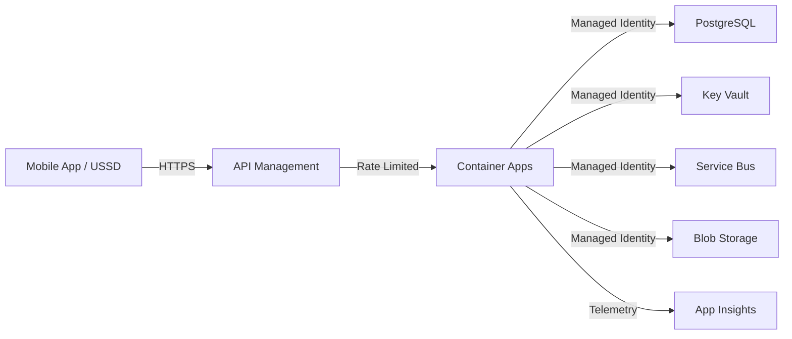

# Azure Infrastructure - Digital Stokvel Banking

This directory contains the Azure infrastructure as code (Bicep) for the Digital Stokvel Banking platform (Phase 0).

## 📁 Structure

```
infra/
├── main.bicep                    # Main orchestration template
├── modules/                      # Bicep modules for individual services
│   ├── container-apps.bicep      # Azure Container Apps (backend API)
│   ├── postgres.bicep            # PostgreSQL Flexible Server 16.x
│   ├── keyvault.bicep            # Key Vault (secrets management)
│   ├── apim.bicep                # API Management (USSD gateway)
│   ├── monitoring.bicep          # Application Insights & Log Analytics
│   ├── storage.bicep             # Blob Storage (ledger exports, audit logs)
│   ├── servicebus.bicep          # Service Bus (async message processing)
│   ├── rbac-keyvault.bicep       # RBAC: Key Vault Secrets User
│   ├── rbac-storage.bicep        # RBAC: Storage Blob Data Contributor
│   └── rbac-servicebus.bicep     # RBAC: Service Bus Data Sender/Receiver
└── parameters/                   # Environment-specific parameters
    ├── dev.parameters.json       # Development environment
    └── prod.parameters.json      # Production environment
```

## 🏗️ Architecture Overview

### Resource Map

| Resource | Purpose | SKU (Dev) | SKU (Prod) |
|----------|---------|-----------|------------|
| **Container Apps** | Backend API hosting | 0.5 CPU, 1GB RAM | 2 CPU, 4GB RAM, 3-10 replicas |
| **PostgreSQL 16.x** | Primary database | Standard_D2s_v3, 32GB | Standard_D4s_v3, 128GB, HA |
| **Key Vault** | Secrets management | Standard | Standard |
| **API Management** | USSD gateway, rate limiting | Consumption | Standard (1 unit) |
| **Application Insights** | APM, custom metrics | N/A | N/A |
| **Log Analytics** | Centralized logging | 1GB/day cap | 10GB/day cap |
| **Blob Storage** | Ledger PDFs, audit logs | Standard_LRS | Standard_GRS |
| **Service Bus** | Async processing | Basic | Standard |

### Data Flow



## 🔐 Security & Compliance

- **SP-04**: All data encrypted at rest (AES-256) and in transit (TLS 1.2+)
- **SP-05**: Managed identities for all Azure service-to-service auth (no connection strings)
- **SP-10**: Data residency in South Africa North (primary) and South Africa West (DR)
- **NF-07**: Audit logs retained for 7 years
- **NF-08**: Automated backups every 6 hours, 35-day retention, geo-redundant for prod

## 📋 Prerequisites

### Required Tools

- **Azure CLI**: Version 2.50+ ([Install](https://learn.microsoft.com/en-us/cli/azure/install-azure-cli))
- **Bicep**: Version 0.20+ (bundled with Azure CLI)
- **PowerShell**: 7.3+ (for Windows deployment scripts)
- **Azure Subscription**: Owner or Contributor role
- **Azure AD Permissions**: Ability to create Entra ID app registrations (for PostgreSQL admin)

### Azure Permissions

| Scope | Required Roles |
|-------|----------------|
| **Subscription** | Contributor (deploy resources) |
| **Azure AD (Entra ID)** | User (create PostgreSQL Entra ID admin) |
| **RBAC** | User Access Administrator (assign roles to managed identities) |

### Get Your Azure AD Object ID

```powershell
# Get your Object ID for PostgreSQL admin
az ad signed-in-user show --query id -o tsv
```

## 🚀 Deployment

### 1. Configure Parameters

Edit `infra/parameters/dev.parameters.json`:

```json
{
  "postgresAdminObjectId": {
    "value": "<PASTE_YOUR_OBJECT_ID_HERE>"
  },
  "postgresAdminLogin": {
    "value": "your.email@stokvel.bank"
  },
  "ownerEmail": {
    "value": "your.email@stokvel.bank"
  }
}
```

### 2. Deploy to Development

```powershell
# Login to Azure
az login

# Set subscription (if you have multiple)
az account set --subscription "<YOUR_SUBSCRIPTION_ID>"

# Create resource group
az group create `
  --name digitalstokvel-dev-rg `
  --location southafricanorth

# Deploy infrastructure
az deployment group create `
  --resource-group digitalstokvel-dev-rg `
  --template-file main.bicep `
  --parameters @parameters/dev.parameters.json
```

### 3. Deploy to Production

```powershell
# Create production resource group
az group create `
  --name digitalstokvel-prod-rg `
  --location southafricanorth

# Deploy infrastructure (with confirmation prompt)
az deployment group create `
  --resource-group digitalstokvel-prod-rg `
  --template-file main.bicep `
  --parameters @parameters/prod.parameters.json `
  --confirm-with-what-if
```

### 4. Verify Deployment

```powershell
# List deployed resources
az resource list `
  --resource-group digitalstokvel-dev-rg `
  --output table

# Get deployment outputs
az deployment group show `
  --resource-group digitalstokvel-dev-rg `
  --name main `
  --query properties.outputs
```

## 🔑 Post-Deployment Configuration

### 1. Populate Key Vault Secrets

After deployment, populate the following secrets manually:

```powershell
# Set Key Vault name
$keyVaultName = "digitalstokveldkv" # Use actual name from output

# Azure Communication Services connection string
az keyvault secret set `
  --vault-name $keyVaultName `
  --name "AzureCommunicationServicesConnectionString" `
  --value "endpoint=https://...;accesskey=..."

# USSD Gateway API Key (from MNO aggregator)
az keyvault secret set `
  --vault-name $keyVaultName `
  --name "USSDGatewayAPIKey" `
  --value "<API_KEY_FROM_MNO>"
```

### 2. Configure PostgreSQL Database Schema

```powershell
# Connect to PostgreSQL using Azure AD auth
psql "host=digitalstokvel-dev-postgres.postgres.database.azure.com port=5432 dbname=digitalstokvel user=your.email@stokvel.bank sslmode=require"

# Run migration scripts from src/backend
\i scripts/init-db.sql
```

### 3. Update Container App with Backend Image

```powershell
# After building and pushing backend Docker image to ACR
az containerapp update `
  --name digitalstokvel-dev-api `
  --resource-group digitalstokvel-dev-rg `
  --image <YOUR_ACR>.azurecr.io/digitalstokvel-api:latest
```

## 📊 Monitoring & Alerts

### Application Insights Custom Metrics

The backend API logs the following custom metrics (configured in Application Insights):

- `GroupCreated` — New stokvel group registrations
- `ContributionCompleted` — Successful member contributions
- `PayoutInitiated` — Payout workflow started
- `DisputeRaised` — Dispute escalations
- `USSDSessionCompleted` — USSD session success/failure

### Pre-Configured Alerts

| Alert | Threshold | Action |
|-------|-----------|--------|
| **API Response Time** | >1 second (95th percentile) | Email DevOps team |
| **Error Rate** | >5% | Email + SMS |
| **USSD Success Rate** | <90% | Email DevOps team |
| **API Downtime** | >5 minutes | Email + SMS |

### View Alerts

```powershell
# View alert rules
az monitor metrics alert list `
  --resource-group digitalstokvel-dev-rg `
  --output table

# View alert history
az monitor activity-log list `
  --resource-group digitalstokvel-dev-rg `
  --start-time 2024-03-24T00:00:00Z `
  --output table
```

## 💰 Cost Estimation

### Development Environment (Monthly)

| Resource | Cost |
|----------|------|
| Container Apps (1 replica, 0.5 CPU) | ~$30 |
| PostgreSQL (Standard_D2s_v3, 32GB) | ~$150 |
| Key Vault (1000 operations) | ~$3 |
| API Management (Consumption) | ~$5 (pay-per-call) |
| Application Insights (1GB) | ~$3 |
| Blob Storage (10GB) | ~$1 |
| Service Bus (Basic) | ~$10 |
| **Total** | **~$202/month** |

### Production Environment (Monthly)

| Resource | Cost |
|----------|------|
| Container Apps (3-10 replicas, 2 CPU) | ~$200-500 |
| PostgreSQL (Standard_D4s_v3, 128GB, HA) | ~$600 |
| Key Vault (10,000 operations) | ~$10 |
| API Management (Standard, 1 unit) | ~$700 |
| Application Insights (10GB) | ~$30 |
| Blob Storage (100GB, GRS) | ~$10 |
| Service Bus (Standard) | ~$25 |
| **Total** | **~$1,575-1,875/month** |

## 🛠️ Troubleshooting

### Issue: Bicep Deployment Fails with "InvalidTemplate"

**Solution**: Validate Bicep syntax:

```powershell
az bicep build --file main.bicep
```

### Issue: PostgreSQL Authentication Fails

**Solution**: Verify Entra ID admin is configured:

```powershell
az postgres flexible-server ad-admin list `
  --resource-group digitalstokvel-dev-rg `
  --server-name digitalstokvel-dev-postgres
```

### Issue: Container App Cannot Access Key Vault

**Solution**: Verify RBAC role assignment:

```powershell
az role assignment list `
  --assignee <MANAGED_IDENTITY_PRINCIPAL_ID> `
  --scope /subscriptions/<SUB_ID>/resourceGroups/digitalstokvel-dev-rg/providers/Microsoft.KeyVault/vaults/<VAULT_NAME>
```

### Issue: High Costs in Production

**Solution**: Review scaling configuration:

```powershell
# Check Container Apps replica count
az containerapp show `
  --name digitalstokvel-prod-api `
  --resource-group digitalstokvel-prod-rg `
  --query properties.template.scale
```

## 🔄 Disaster Recovery

### Backup Configuration

- **PostgreSQL**: Automated backups every 6 hours, 35-day retention
- **Blob Storage**: Geo-redundant storage (GRS) for production

### Recovery Procedures

1. **RTO**: 4 hours (NF-08)
2. **RPO**: 6 hours (NF-08)

```powershell
# Restore PostgreSQL from backup
az postgres flexible-server restore `
  --resource-group digitalstokvel-prod-rg `
  --name digitalstokvel-prod-postgres-restored `
  --source-server digitalstokvel-prod-postgres `
  --restore-time "2024-03-24T12:00:00Z"
```

## 📝 Resource Naming Convention

Format: `{projectName}-{environment}-{resourceType}`

Example:
- `digitalstokvel-dev-api` (Container App)
- `digitalstokvel-prod-postgres` (PostgreSQL)
- `digitalstokvelprodkv` (Key Vault - alphanumeric only)

## 🤝 Contributing

Before modifying infrastructure:

1. Test changes in `dev` environment first
2. Run `az deployment group validate` before actual deployment
3. Document any new resources or configuration changes in this README

## 📞 Support

- **DevOps Team**: devops@stokvel.bank
- **On-Call Rotation**: +27 82 123 4567 (Production incidents only)

## 📚 References

- [PRD Section 7.1: Technology Stack](../docs/digital-stokvel-prd.md#71-technology-stack)
- [PRD Section 9: Non-Functional Requirements](../docs/digital-stokvel-prd.md#9-non-functional-requirements)
- [PRD Section 10: Security and Privacy](../docs/digital-stokvel-prd.md#10-security-and-privacy)
- [Azure architectures for PostgreSQL](https://learn.microsoft.com/en-us/azure/architecture/databases/idea/postgresql-migration)

```bash
# Create resource group
az group create \
  --name digital-stokvel-prod \
  --location southafricanorth

# Deploy infrastructure
az deployment group create \
  --resource-group digital-stokvel-prod \
  --template-file main.bicep \
  --parameters @parameters/prod.parameters.json
```

## Resources Deployed

| Resource | Dev SKU | Prod SKU |
|----------|---------|----------|
| Container Apps | Consumption | Consumption |
| PostgreSQL | Burstable B1ms | General Purpose D2ds_v4 |
| Key Vault | Standard | Premium (HSM) |
| API Management | Consumption | Standard |
| Application Insights | Standard | Standard |
| Storage Account | Standard LRS | Standard ZRS |
| Service Bus | Standard | Standard |

## Data Residency

**CRITICAL**: All resources MUST be deployed in South Africa regions per SARB regulations.

- **Primary**: South Africa North (southafricanorth)
- **DR**: South Africa West (southafricawest)

## RBAC Assignments

The infrastructure uses **managed identities** for authentication between services:

- Container Apps → Key Vault (Secret Reader)
- Container Apps → PostgreSQL (Built-in authentication)
- Container Apps → Storage Account (Blob Data Contributor)
- Container Apps → Service Bus (Sender/Receiver)

## License

Proprietary - All rights reserved.
